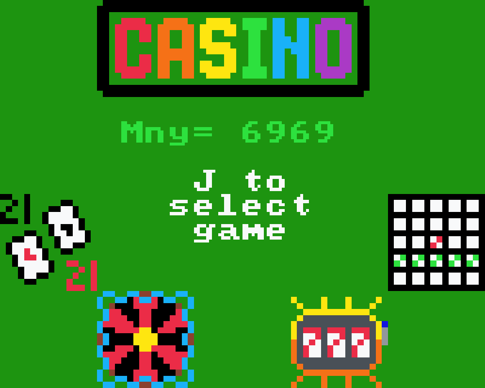

# Casino - Don't Gamble
A four in one sprig game with Blackjack, Roulette, Slots, and Bingo.

This project took ~1500 lines of code with another ~1500 lines of sprites, using all characters possible to define sprites for map declaration.

It took a total of over 24 hours after much attention to detail and debugging.

Have fun in my biggest bowl of spaghetti yet.

How can it be played?
Most of the time you can use WASD for cursor movement and J for selecting. In certain cases, I can redo a bet, K can go home, and L can shortcut for confirm.
For blackjack, you set a bet with W and S then hit J to hit, receiving cards. You can hit for more cards or stand with L to let the dealer go. If you go over 21 or the dealer gets a higher number than you under 21, then you lose.
For roulette, you choose an outcome for the wheel by clicking J on it. These include a specific number, red or black, even or odd, or thirds. You can then set a bet amount by selecting chips with J and spin the wheel to see if you've won.
For slots, with J you select a bet of 1, 2, or 3 money and spin to randomize the 3 slots. The payouts are detailed on a selectable help menu.
For bingo, you pay 100 to play and roll numbers balls with L, selecting a corresponding number on your card with J until you get 5 matches in a row. You get payed based on the number of balls used.
You can return to the home by selecting the home button on any of the games.

